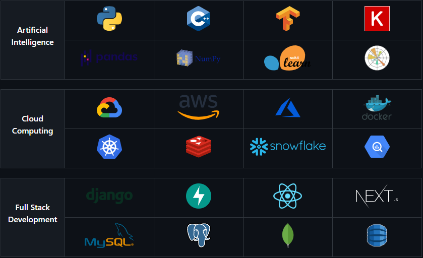

<head>
    <meta charset="utf-8">
    <meta name="viewport" content="width=device-width, initial-scale=1">
    <meta name="description" content="Haider Sultan's GitHub Profile">
    <meta name="keywords" content="Haider Sultan, Haider, Sultan, HaiderSultanArc, Arc, ArcHaiderSultan, ArcHaider, ArcSultan">
    <meta name="author" content="Haider Sultan">
    <link rel="stylesheet" type="text/css" href="./assets/style.css">
</head>

<h1 align='center'>Hi 👋, I'm an AI Engineer</h1>

#### Now

- ✨ AI Engineer @ [OpenAIMP](https://www.openaimp.com/)
- ⚙️ Working on: `Scalable AI Applications`, `Cloud Computing`, `MLOps`
- 🌱 Currently learning `Natural Language Processing`
- 📫 Reach me on LinkedIn: [HaiderSultanArc](https://www.linkedin.com/in/haidersultanarc/)
- 📝 Checkout my [Resume](resume/resume.pdf)
- 📑 Checkout my [CV](resume/cv.pdf)
- 👨‍💻 Checkout my [Website](https://haidersultanarc-hs.web.app/)

##  

<h3 align="left">Languages and Tools:</h3>

<!-- <table align="center">
    <tr>
        <th align='center' width='100px' rowspan="2">
            
Artificial Intelligence

        </th>
        <td align='center' width='150px'>
            
        </td>
        <td align='center' width='150px'>
            
        </td>
        <td align='center' width='150px'>
            
        </td>
        <td align='center' width='150px'>
            
        </td>
    </tr>
    <tr>
        <td align='center' width='150px'>
            
        </td>
        <td align='center' width='150px'>
            
        </td>
        <td align='center' width='150px'>
            
        </td>
        <td align='center' width='150px'>
            
        </td>
    </tr>
    <tr height='20px'></tr>
    <tr>
        <th align='center' width='100px' rowspan='2'>
            
Cloud Computing

        </th>
        <td align='center' width='150px'>
            
        </td>
        <td align='center' width='150px'>
            
        </td>
        <td align='center' width='150px'>
            
        </td>
        <td align='center' width='150px'>
            
        </td>
    </tr>
    <tr>
        <td align='center' width='150px'>
            
        </td>
        <td align='center' width='150px'>
            
        </td>
        <td align='center' width='150px'>
            
        </td>
        <td align='center' width='150px'>
            
        </td>
    </tr>
    <tr height='20px'></tr>
    <tr>
        <th align='center' width='100px' rowspan='2'>
            
Full Stack Development

        </th>
        <td align='center' width='150px'>
            
        </td>
        <td align='center' width='150px'>
            
        </td>
        <td align='center' width='150px'>
            
        </td>
        <td align='center' width='150px'>
            
        </td>
    </tr>
    <tr>
        <td align='center' width='150px'>
            
        </td>
        <td align='center' width='150px'>
            
        </td>
        <td align='center' width='150px'>
            
        </td>
        <td align='center' width='150px'>
            
        </td>
    </tr>
</table> -->

##  

<!--  -->

<!--  -->

##  
<h3 align="left">Connect with me:</h3>

